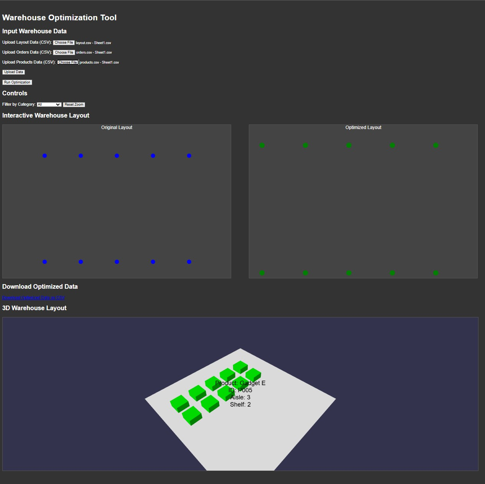

#  Warehouse Optimization Tool

## 📌 Project Overview
The **Warehouse Optimization Tool** is a web-based application designed to **visualize and optimize warehouse layouts** based on product demand and order frequency. The tool helps warehouse managers efficiently place high-demand products in optimal locations to improve order fulfillment speed and inventory management.

This project utilizes **data-driven optimization techniques** and **3D visualization** to provide a clear and interactive representation of warehouse layouts.

---

##  Features
✅ Upload warehouse, orders, and product data in CSV format  
✅ Interactive **2D and 3D** warehouse layout visualization  
✅ **Optimized Layout Generation** based on demand  
✅ **Hover functionality** to display product details  
✅ Downloadable **optimized layout CSV**  
✅ **D3.js and Babylon.js** integration for enhanced visualization  

---

## 🖼️ Project Showcase
### **Final Warehouse Layout Visualization**

> *Screenshot of the tool showcasing the original and optimized warehouse layouts along with the 3D visualization.*

---

## 🛠️ Technologies Used
- **Frontend:** HTML, CSS, JavaScript  
- **Backend:** Python (Flask)  
- **Libraries:** D3.js, Babylon.js, Pandas, Matplotlib  
- **Database:** CSV-based data processing  
- **Optimization:** Linear Sum Assignment (Scipy)  

